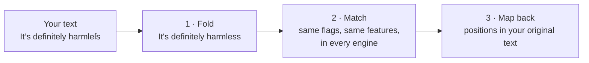

# regex-parity

**Live demo: https://yauhenbichel.github.io/regex-parity/**

**The same regular expression can give different answers in JavaScript, Python and Java.** It
happens as soon as text contains accented letters, look-alike characters, smart quotes or invisible
characters, which is most real text.

For example, a rule meant to catch false reassurance, checked against `That's definitely harmleſs.`
(with a long s, U+017F, in "harmless"):

| | JavaScript | Python | Java |
|---|---|---|---|
| Does `\bharmless\b` match? | no | yes | yes |

**regex-parity is a small library with the same functions in JavaScript, Python, Java, Go, Rust, C# and
Ruby. It makes one set of regex rules give the same answer in all of them**, and comes with a command that checks
your rules before you ship them.

**[Try it in your browser](https://yauhenbichel.github.io/regex-parity/)**: type a pattern and some
text and watch plain JavaScript and plain Python disagree while regex-parity agrees with itself.

## How it works

Every call runs the same three steps, in each language:



**1. Fold the text.** Characters that look alike become one form before anything is matched:

| In the text | Becomes | Why |
|---|---|---|
| `harmleſs` (long s), `ｏｒｄｅｒ １２３` (full-width), `K` (Kelvin sign) | `harmless`, `order 123`, `K` | Unicode NFKC, one character at a time |
| zero-width spaces, soft hyphens, direction marks | removed | they split a word without being seen |
| `’` `‘` `“` `”` | `'` and `"` | phones type these instead of straight quotes |
| `–` `—` `−` | `-` | |
| no-break and other wide spaces | a space | |
| carriage return, line and paragraph separators | a newline | engines disagree about what `.` and `\s` cross |

regex-parity remembers where every folded character came from.

**2. Match the same way everywhere.** The pattern runs on the folded text with ASCII behaviour for
`\b`, `\w`, `\d`, `\s` and case, in every engine: JavaScript with flags `gi` (never `u`), Python with
`re.IGNORECASE | re.ASCII`, Java with `CASE_INSENSITIVE` and `\b` rewritten, because Java's own `\b`
treats `é` as a letter. Patterns that engines read differently are refused up front, with the
reason: lookbehind, backreferences, `$`, inline flags, `\p{…}`, non-ASCII characters and a few more.
The full list is in [docs/SPEC.md](docs/SPEC.md).

**3. Report positions in the original text.** A match on the folded text is mapped back, so its
`start`, `end` and `text` point at exactly what was written, invisible characters included.

**It is tested, not promised.** Every package must reproduce one shared file,
[`conformance/cases.tsv`](conformance/cases.tsv): 121 cases, each a rule, a text and the exact
positions found. CI runs it in all seven languages on every change.

## How it helps

When the same rule runs in more than one place, such as a moderation filter in a web app and in a
Python backend, redaction in a Java service and a Node worker, or a safety guard ported to three
languages, plain regex lets those copies quietly disagree on real text. The tests still pass,
because examples are typed in plain ASCII.

With regex-parity:

- every language gives the same findings for the same rule and the same text;
- tricks such as zero-width spaces, full-width letters and look-alike characters stop getting past
  your rules;
- `regex-parity check` turns each example into seven look-alike versions and fails the build if any
  of them gets a different answer.

## Use it

Go is published. The other packages are released from this repository by one tag once each registry is set up
([docs/RELEASING.md](docs/RELEASING.md)); until then, install them from the repository as shown.

**JavaScript** (Node 20+): `npm install ./packages/js` from a clone.

```js
import { matches, findAll, evaluate } from "regex-parity";

matches(String.raw`\bharmless\b`, "definitely harmleſs");       // true; new RegExp(…, "gi") says false
findAll(String.raw`\border\s+\d{6}\b`, "order １２３４５６");        // [{ start: 0, end: 12, text: "order １２３４５６" }]

const promise = { id: "promise", patterns: [String.raw`\bready\s+by\s+friday\b`], unless: [String.raw`\bif\b`] };
evaluate(promise, "Ready by Friday. Honestly.");                // [{ rule: "promise", start: 0, end: 15, text: "Ready by Friday" }]
evaluate(promise, "Ready by Friday if the review passes.");     // []: the "if" is in the same sentence
```

**Python** (3.10+, no dependencies):
`pip install "git+https://github.com/YauhenBichel/regex-parity#subdirectory=packages/python"`

```python
import regex_parity as rp

rp.matches(r"\bharmless\b", "definitely harmleſs")          # True
rp.find_all(r"\border\s+\d{6}\b", "order １２３４５６")      # [Match(start=0, end=12, text='order １２３４５６')]
promise = rp.Rule("promise", (r"\bready\s+by\s+friday\b",), unless=(r"\bif\b",))
rp.evaluate(promise, "Ready by Friday if the review passes.")  # []
```

**Java** (17+, no dependencies): `cd packages/java && gradle publishToMavenLocal`, then depend on
`io.github.yauhenbichel:regex-parity:0.2.0`.

```java
import io.github.yauhenbichel.regexparity.RegexParity;

RegexParity.matches("\\bharmless\\b", "definitely harmleſs", false);   // true
RegexParity.findAll("\\border\\s+\\d{6}\\b", "order １２３４５６", false);  // [Match[start=0, end=12, text=order １２３４５６]]
```

**Go** (1.26+; the only dependency is `golang.org/x/text`, for NFKC):
`go get github.com/YauhenBichel/regex-parity/go@v0.2.0` (published)

```go
import regexparity "github.com/YauhenBichel/regex-parity/go"

ok, _ := regexparity.Matches(`\bharmless\b`, "definitely harmleſs", false)       // true
found, _ := regexparity.FindAll(`\border\s+\d{6}\b`, "order １２３４５６", false)  // [{Start:0 End:24 Text:order １２３４５６}]: Go counts bytes
```

**Rust**: `cargo add regex-parity --git https://github.com/YauhenBichel/regex-parity`

```rust
use regex_parity::{find_all, matches};

assert!(matches(r"\bharmless\b", "definitely harmleſs", false)?);
let found = find_all(r"\border\s+\d{6}\b", "order １２３４５６", false)?;   // one match: bytes 0 to 24
```

**C#** (.NET 8+, no dependencies): from a clone, `dotnet add reference packages/dotnet/src/RegexParity`

```csharp
using RegexParity;

Parity.Matches(@"\bharmless\b", "definitely harmleſs");         // true
Parity.FindAll(@"\border\s+\d{6}\b", "order １２３４５６");         // one match: start 0, end 12
```

**Ruby** (3.1+, no dependencies): in a Gemfile,
`gem "regex-parity", git: "https://github.com/YauhenBichel/regex-parity", glob: "packages/ruby/*.gemspec"`

```ruby
require "regex_parity"

RegexParity.matches?('\bharmless\b', "definitely harmleſs")        # => true
RegexParity.find_all('\border\s+\d{6}\b', "order １２３４５６")         # one match: start 0, end 12
```

### Check your rules before you ship them

A rule has patterns, optional `unless` patterns that cancel a match in the same sentence, and
examples ([`examples/rules.yaml`](examples/rules.yaml)):

```yaml
rules:
  - id: delivery-promise
    title: Promising a date nobody agreed
    patterns:
      - '\bwill\s+(?:be\s+)?(?:ready|done|shipped)\s+by\s+(?:monday|tuesday|wednesday|thursday|friday|tomorrow)\b'
    unless:
      - '\bif\b'
    examples:
      match:
        - "It will be ready by Friday."
      no_match:
        - "It will be ready by Friday if the review goes well."
```

```console
$ node packages/js/src/cli.js check examples/rules.yaml
ok   false-reassurance  4 examples, 20 look-alike variants
ok   delivery-promise  3 examples, 10 look-alike variants
ok   order-number  2 examples, 8 look-alike variants
regex-parity: 3 rules give the same answers in every regex-parity language
```

And one text at a time (that `K` is U+212A, the Kelvin sign):

```console
$ node packages/js/src/cli.js try '\bknow\b' 'I Know this.'
text           I \u212anow this.
folded         I Know this.
plain JS (gi)  no match
regex-parity   matches ["Know"]
```

## Status

Version 0.1.0: the libraries in three languages, the rule checker, the shared conformance cases and
the live demo. Not yet published to package registries. Next: publishing, then the code generator
described in the [design](docs/architecture/0001-design.md).
[`test/evidence`](test/evidence) keeps the original measurements of plain engines disagreeing.

## Not a medical device

regex-parity checks text with regular expressions. It does not diagnose anything, and it is not a
safety certification for a product built with it. Some examples mention health wording because
that is where the problem was found.

## Licence

Apache-2.0.

## Contributors

<!-- readme: contributors,bots/- -start -->
<p align="center">
  <a href="https://github.com/YauhenBichel" title="Yauhen Bichel" aria-label="Yauhen Bichel"></a>
</p>
<!-- readme: contributors,bots/- -end -->
